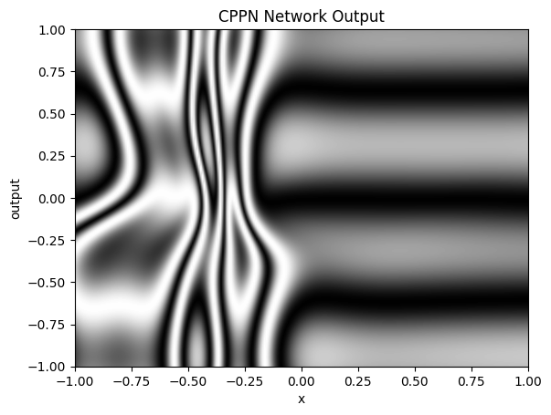
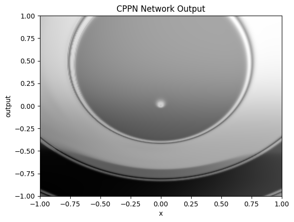
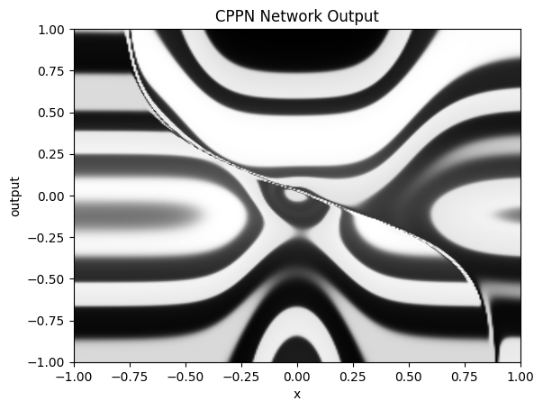

# CPPNs in JAX

CPPNs, introduced by Kenneth Stanley and used in open-ended learning projects like PicBreeder, Enhanced POET and HyperNEAT are sparse neural networks amenable to evolutionary methods.

This library implements a CPPN for educational reasons, making use of JAX to speed computation. I hope to extend it to implementations of CPPN-related algorithms such as NEAT and HyperNEAT.

This library owes a lot to [NEAT-Python](https://github.com/CodeReclaimers/neat-python/tree/master) whose implementation I often used as a reference for many details lacking from the original CPPN paper.

# Example Images

